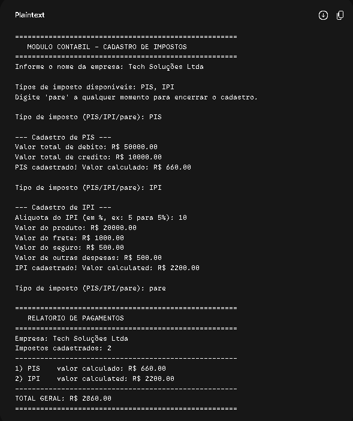

# AgenciaViagens - Gestão de Pacotes de Viagem

Aplicação em linha de comando (CLI) desenvolvida em **Java** para cadastro, gestão e cálculo de vendas de pacotes de viagens e serviços turísticos.

---

##  Sobre o Projeto

O **AgenciaViagens** é um sistema desenvolvido para simular o funcionamento do módulo de reservas e vendas de uma agência de turismo, aplicando regras de negócio para diferentes tipos de pacotes e serviços com base nos princípios da Programação Orientada a Objetos (POO).

---

##  Funcionalidades

- **Cadastro de Pacotes de Viagem:** Registo e estruturação de opções de viagens nacionais e internacionais.
- **Cálculo de Custos e Impostos:** Aplicação automatizada de taxas, margens de lucro e conversão de valores.
- **Gestão de Vendas:** Registo de orçamentos e vendas associadas aos clientes.
- **Relatórios no Terminal:** Listagem detalhada dos pacotes disponíveis e resumos de vendas.

---

  Conceitos de POO Aplicados

* **Abstração:** Modelação do domínio de turismo com classes base para representar itens de viagem e serviços.
* **Herança:** Especialização de classes para tratamento diferenciado de pacotes e taxas específicas.
* **Polimorfismo:** Sobrescrita de métodos (`@Override`) para cálculo personalizado de custos e preços finais de venda.
* **Encapsulamento:** Proteção dos dados dos clientes e pacotes utilizando modificadores de acesso e métodos acessores (`getters` e `setters`).

---

  Estrutura do Repositório

```text
agencia-viagens/
├── src/
│   └── (Ficheiros .java do projeto)
├── .gitignore
├── README.md
└── print.png
```

Como Executar
Pré-requisitos
Java Development Kit (JDK) 11 ou superior instalado.

Demonstração Visual



---

👤 Autor

Desenvolvido por **Eduardo Amaral**  
[GitHub Profile](https://github.com/Ravz7) | [LinkedIn](https://www.linkedin.com/in/eduardo-amaral-de-morais-2785a53a0/)
